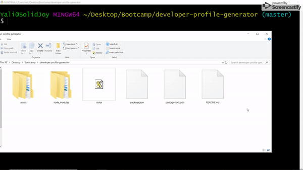

# Developer Profile Generator

## Description

A command line application that generates a basic PDF profile based on the user input. The user is asked to input their GitHub username and their favorite color. The username is used to make a call to the GitHub API and retrieve some basic information, such as the users name, GitHub profile, number of followers, etc. The information is written to an HTML file which is then converted to PDF format. The user's favorite color is used to determine the background color of the cards in the HTML file.

## Demo of Working App



## Code Snipet

```
            var htmlFile = 
                `
                <body class="bg-secondary">
                    <style>
                        .card{
                            background-color: ${color};
                        }
                    </style>

                    <div class="container">
                        <div class="card text-center text-${textColor} mt-3">
                            <div class="card-body">
                
                                
                
                                <h1 class="mt-3">Hello, My name is ${name}</h1>
                
                                <a class="info-link text-${textColor}" href="https://www.google.com/maps/place/${location}" target="#blank"><i class="fas fa-map-marker-alt"></i> San Francisco, CA</a>
                                <a class="info-link text-${textColor} ml-3" href="${githubProfile}" target="#blank"><i class="fab fa-github"></i> GitHub</a>
                                <a class="info-link text-${textColor} ml-3" href="${blog}" target="#blank"><i class="fas fa-rss"></i> Blog</a>
                            </div>
                        </div>
                
                        <p class="text-center text-white mt-3" id="bio">${bio}</p>
                
                        <div class="info-card card text-center text-${textColor} mb-3">
                            <div class="card-body">
                                <h2>Public Repositories</h2>
                                <h2>${numRepos}</h2>
                            </div>
                        </div>
                    
                        <div class="info-card card text-center text-${textColor} mb-3 ml-3">
                            <div class="card-body">
                                <h2>Followers</h2>
                                <h2>${numFollowers}</h2>
                            </div>
                        </div>
                
                        <div class="info-card card text-center text-${textColor} mb-3">
                            <div class="card-body">
                                <h2>GitHub Stars</h2>
                                <h2>${numStars}</h2>
                            </div>
                        </div>
                        
                        <div class="info-card card text-center text-${textColor} mb-3 ml-3">
                            <div class="card-body">
                                <h2>Following</h2>
                                <h2>${numFollowing}</h2>
                            </div>
                        </div>
                     
                    </div>
                </body>
                </html>                
                `;
```
The HTML file is written as a template literal which contains all the information gathered from the GitHub API. The template literal is stored in a variable called htmlFile. This variable is then passed to the html-pdf module to be converted into PDF format.

## Technologies Used
* [html-pdf](https://www.npmjs.com/package/html-pdf)
* [Axios](https://www.npmjs.com/package/axios)
* [Inquirer](https://www.npmjs.com/package/inquirer)
* [node.js](https://nodejs.org/en/)
* [HTML](https://developer.mozilla.org/en-US/docs/Web/HTML)
* [CSS](https://developer.mozilla.org/en-US/docs/Web/CSS)
* [Javascript](https://developer.mozilla.org/en-US/docs/Web/JavaScript)
* [jQuery](https://jquery.com/)
* [Bootstrap](https://getbootstrap.com/)
* [Git](https://git-scm.com/)
* [GitHub](https://github.com/)
* [VSCode](https://code.visualstudio.com/)

## Author

**Yalí Miranda** 

* [Github](https://github.com/yjmiranda)
* [LinkedIn](https://www.linkedin.com/in/yal%C3%AD-miranda-8b4b94199/)